# ask-her-out

A page that asks your love on a date. The No button doesn't want to be clicked.

It started as one HTML file I made for my girlfriend. Now there's also a **free builder**: anyone can sign in, fill in a form and get their own link to send.

| | Link |
|---|---|
| 💌 **My page** (the original, for my girlfriend) | https://markbasa96.github.io/ask-her-out/ |
| 🌅 **Make your own** (the builder) | https://ask-her-out-orpin-psi.vercel.app |
| 📋 **Your pages and answers** (the dashboard) | https://ask-her-out-orpin-psi.vercel.app/dashboard.html |

> The builder goes live at the Vercel link once this version is merged into `main`. Until then that link shows the older version.

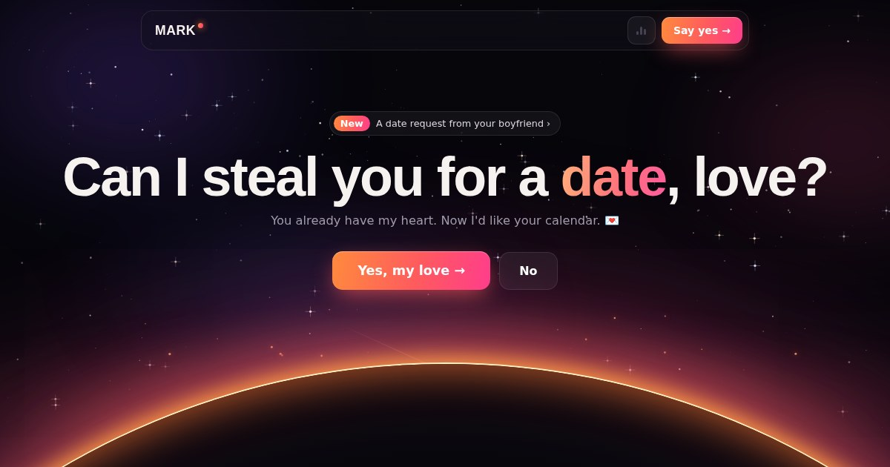

---

## Contents

- [What the page does](#what-the-page-does)
- [Option 1: make your own page with the builder (no code)](#option-1-make-your-own-page-with-the-builder-no-code)
- [Option 2: copy the repo and edit it yourself](#option-2-copy-the-repo-and-edit-it-yourself)
- [Option 3: run your own copy of the whole builder](#option-3-run-your-own-copy-of-the-whole-builder)
- [How it's built](#how-its-built)
- [Privacy and safety](#privacy-and-safety)
- [FAQ and troubleshooting](#faq-and-troubleshooting)
- [History](#history)

---

## What the page does

A question sits under a moving night sky: "Can I steal you for a date, love?", with a Yes button, a No button, and a card about the hopeless romantic who's asking.

**The sky is alive.** Three layers of drifting, twinkling stars and a faint Milky Way band. Shooting stars every second or two, a bigger comet with a sparkling tail every few seconds, and every so often a group of stars joins up into a heart and fades. Slow purple and pink clouds drift behind everything, and embers float up from a sunset glow that rises when the page opens. Moving the mouse shifts the stars a little, and tapping the sky bursts out sparkles and hearts.

**A pixel cat wanders around.** It walks anywhere on the screen, sometimes behind the words and sometimes in front of them. Now and then it stops, sits, and says something sweet in a speech bubble ("psst… he's still crazy about you", "10/10 boyfriend. would recommend."). Tap it and it talks. After a yes, it switches to celebrating.

**The No button runs away, forever.** It jumps when the mouse gets close, and on phones taps make it run instead of counting. Every escape makes Yes a bit bigger, No a bit smaller, and No says something new ("Are you sure, babe? 🥺"). It never gives up. If someone catches it with the keyboard, a kitten holding a heart asks them to reconsider.

**Music plays softly.** A YouTube song starts when the page opens and loops. Browsers don't allow sound before the first tap, so it starts silently and turns the sound on at the first tap or key press. The speaker icon in the top bar mutes and unmutes it.

**Yes opens the planner.** Confetti, then a frosted-glass pop-up: tappable day cards for the next three weeks, what you're doing (coffee, dinner, a movie or a surprise), a time (or "Other" for any time), their email and an optional note. The button says what's still missing instead of hiding.

**Confirming gives them a ticket.** An "Admit Two" date ticket with the date, time, plan and note, plus **Add to Google Calendar** (with the asker as a guest) and **Save for iPhone / Outlook** (a calendar file). The answer is sent to the asker: by email on my page, or to the dashboard on builder pages.

**Sharing the link looks nice.** Messenger, IG and the like show a preview card with the sunset and the question instead of a bare URL.

---

## Option 1: make your own page with the builder (no code)

This is the easiest way. You need an email address and about three minutes.

### 1. Sign in

Go to **https://ask-her-out-orpin-psi.vercel.app**, type your email and tap **Send me a magic link**. Open the email and tap the link. It brings you back signed in. There's no password.

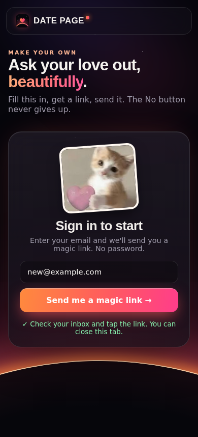

> Didn't get the email? Check spam, wait a minute and try again. The free email sender only sends a few emails per hour.

### 2. Fill in the form

As you type, the phone on the right shows your real page, live. On a phone, the preview sits above the form.

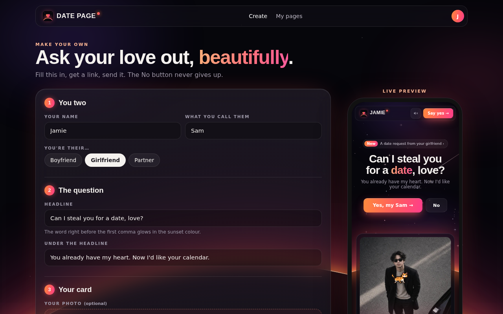

| Step | Field | What it does |
|---|---|---|
| 1 · You two | **Your name** | Shown in the top bar, the card, the ticket and the cat's lines ("psst… Jamie's still crazy about you") |
| | **What you call them** | Your pet name for them, e.g. *love*, *babe*, *Sam*. Used in "Yes, my love →" and the planner |
| | **You're their…** | Boyfriend, girlfriend or partner. Used in "A date request from your girlfriend" and "Please don't leave your girl hanging" |
| 2 · The question | **Headline** | The big question. The word right **before** the first comma glows in the sunset colour, so "Can I steal you for a **date**, love?" |
| | **Under the headline** | One line under the question |
| 3 · Your card | **Your photo** (optional) | A photo of you for the "hopeless romantic" card. JPG, PNG or WebP. It's shrunk in your browser before upload, which also removes location data from phone photos. With no photo, the card shows just the text |
| | **Card title** | e.g. "Jamie, still falling for you every day." The word right **after** the first comma glows |
| | **A few words about you** | A short, sweet paragraph |
| 4 · Music | **YouTube link** (optional) | Paste any YouTube link (`youtube.com/watch?v=…`, `youtu.be/…` or Shorts). Leave it empty for the default song |
| 5 · Your link | **Pick a link** | Your address: `ask-her-out-orpin-psi.vercel.app/p/your-link`. Lowercase letters, numbers and dashes, 3–40 characters. It tells you if it's taken |
| | **Add me as a guest on the calendar invite** | When they tap *Add to Google Calendar*, your email is added as a guest. This puts your email in the page, so untick it if you'd rather not |
| Extras | **What the cat says** (optional) | Your own lines for the pixel cat, one per row. Leave empty for its usual sweet talk |

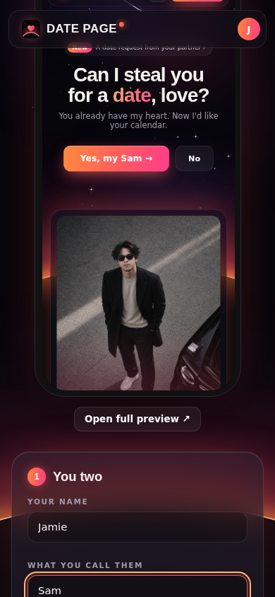

### 3. Publish and send

Tap **Publish my page →**. You get your link with **Copy link**, **Open** and **Share…** (on phones). Send it to them however you like: Messenger, WhatsApp, a text.

### 4. See their answer

When they say yes and lock in a date, it shows up on your **dashboard** (**My pages** in the top bar). New answers have a pink badge.

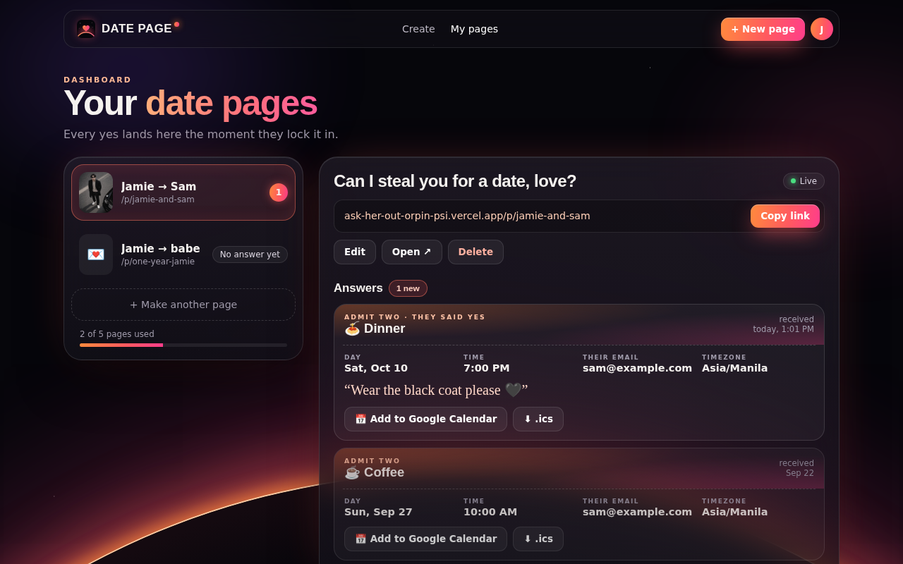

Each answer is a ticket with the **day and time** (in their timezone), what you're doing, their email and their note. It has **Add to Google Calendar** and **.ics** buttons, so you can save it too.

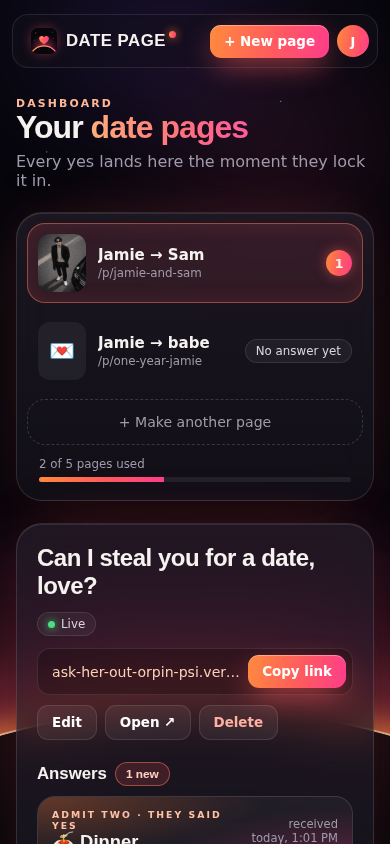

On the dashboard you can also:

- **Edit** a page: change any words, the photo, the song or even the link. The old link stops working if you change it.
- **Delete** a page, along with all its answers and its photo.
- **Make another page**, up to **5 pages** per account.

### What they see

Your link opens your page. It's the same page as mine, with your words, photo and song.

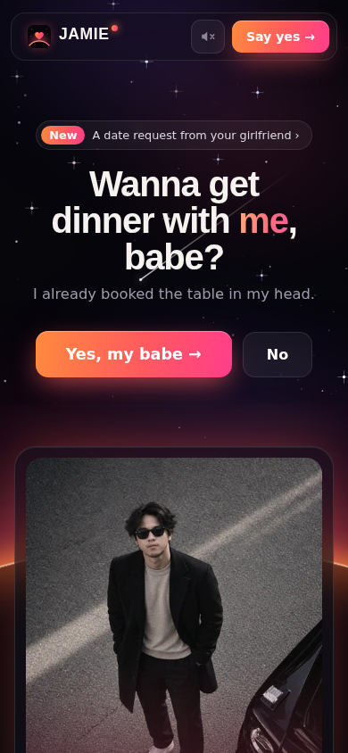 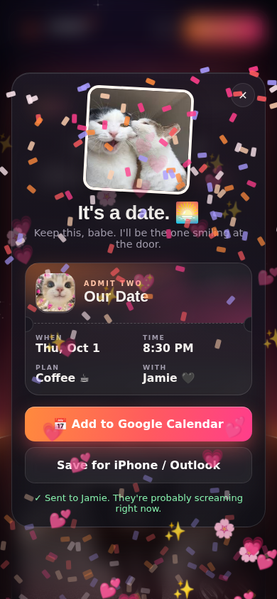

At the bottom there's a small **Make your own** link and a **Report this page** link. If a link is wrong, or a page was taken down, they see a friendly "This page isn't available" message instead.

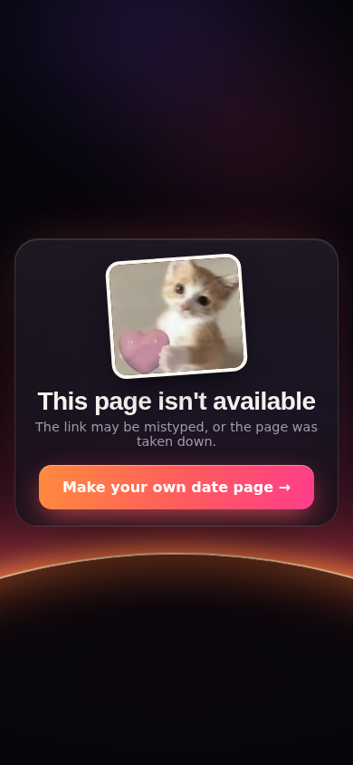

### Limits (to keep it free and friendly)

- 5 pages per account.
- Photos: JPG, PNG or WebP, up to 2 MB after shrinking (big phone photos are fine, they're shrunk automatically).
- Each page accepts up to 10 answers per hour, to stop spam.
- Pages that are reported can be hidden by the admin.

---

## Option 2: copy the repo and edit it yourself

If you'd rather host your own copy and edit the code, this still works exactly as before.

1. **Get the code.** Fork this repo on GitHub, or use **Code → Download ZIP**.
2. **Put in your details.** Open `ask-her-out.html`, find `const CONFIG` near the top of the `<script>`, and change:
   - `name`: your name (top bar, card, ticket, messages)
   - `email`: your email, added as a guest on the Google Calendar invite
   - `formspreeUrl`: make a free form at [formspree.io](https://formspree.io) and paste its URL, so the answers go to *your* inbox and not mine
   - `songId`: the YouTube video ID of your song (the part after `watch?v=`)
   - `photo`: your photo
3. **Swap the pictures** in `Pics/`: your photo, plus the four cat stickers if you like.
4. **Change the words.** The headline, the card text and the lines the cat says are plain text in `ask-her-out.html`. Search for "Can I steal you", "still falling" and `MARK_CAT_LINES`.
5. **Put it online.** Turn on GitHub Pages (**Settings → Pages →** deploy from `main`), or import the repo into [Vercel](https://vercel.com) or Netlify. There's no build step.
6. **Update the link preview.** Change the `og:` tags in `index.html` and `ask-her-out.html` to your own URL, and replace `Pics/og.jpg` with a screenshot of your page (1200×630).

You don't need Supabase for this. If you don't want the builder at all, you can delete `create.html`, `dashboard.html`, `site.css`, `site.js`, `vercel.json` and `supabase/`.

---

## Option 3: run your own copy of the whole builder

For developers who want their own builder with their own database.

1. **Supabase** (free): create a project at [supabase.com](https://supabase.com). In **SQL Editor**, run `supabase/migrations/0001_init.sql`. Then run `0002_seed_admin.sql` with **your** email instead of mine; that email gets the Admin tab.
2. **Keys:** in **Project Settings → API Keys**, copy the project URL and the **publishable** key (`sb_publishable_…`). Paste them into `SUPABASE_URL` / `SUPABASE_KEY` in **both** `site.js` and `ask-her-out.html`. Never use the `service_role` / secret key in these files.
3. **Vercel** (free): **Add New… → Project**, import your fork, Framework Preset **Other**, no build command, output directory = repo root. `vercel.json` handles the `/p/<slug>` links.
4. **Sign-in links:** in Supabase, go to **Authentication → URL Configuration**. Set **Site URL** to your Vercel URL and add `https://<your-vercel-domain>/**` under **Redirect URLs**.
5. **Email (recommended):** Supabase's built-in email sender only sends a few emails per hour. For real use, set up custom SMTP (for example a free [Resend](https://resend.com) account) under **Authentication → Emails → SMTP Settings**.

---

## How it's built

No frameworks and no build step. It's plain HTML, CSS and JavaScript.

| Path | What it is |
|---|---|
| `ask-her-out.html` | The date page: sky, cat, No button, planner, ticket, music. With no slug it's my page (`CONFIG`, Formspree). With `/p/<slug>` or `?p=<slug>` it loads that page from Supabase |
| `index.html` | Redirects to `ask-her-out.html` on GitHub Pages, with link-preview tags |
| `create.html` | The builder: sign in, form, live preview, photo upload, publish and edit |
| `dashboard.html` | A creator's pages and answers, plus the Admin tab (reports, hide/unhide) |
| `site.css`, `site.js` | Shared styles and code for the builder and dashboard (Supabase client, sign-in, helpers) |
| `vercel.json` | Vercel rewrites: `/p/<slug>` → the date page, `/` → the builder |
| `supabase/migrations/` | The database: tables, Row Level Security, limits, photo storage |
| `Pics/` | My photo, the cat stickers, the link-preview image and the logo (`icon.svg`, plus `icon-32.png` and `apple-touch-icon.png` for older browsers and iPhone home screens) |
| `docs/` | Build notes and screenshots |

- **Hosting:** my page is on GitHub Pages. The builder is on Vercel and deploys automatically on every push to `main`.
- **Data:** [Supabase](https://supabase.com) handles magic-link sign-in, a Postgres database (`pages`, `answers`, `reports`, `admins`) and a `photos` storage bucket.
- **Security:** every table uses Row Level Security. Anyone can *read* a page (that's how links work) and *answer* it. Only the page's owner can change it or read its answers. Only the admin can hide pages or read reports. The 5-page and 10-answers-per-hour limits are enforced in the database, not just the page.
- **The sky** is drawn on a canvas. **The cat** is a 20×14 pixel sprite drawn in code. **The music** uses the YouTube IFrame API.
- It works on phones, respects "reduce motion" (the sky and cat hold still), and the pop-ups work with a keyboard.

**The logo** is a heart rising out of the glowing sunset arc, in the same orange-to-pink as the page. It's the browser-tab icon, the iPhone home-screen icon, and the mark in the top bar of every page.

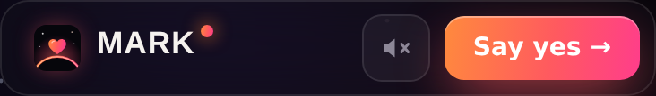

The design was mocked up and approved before it was built:

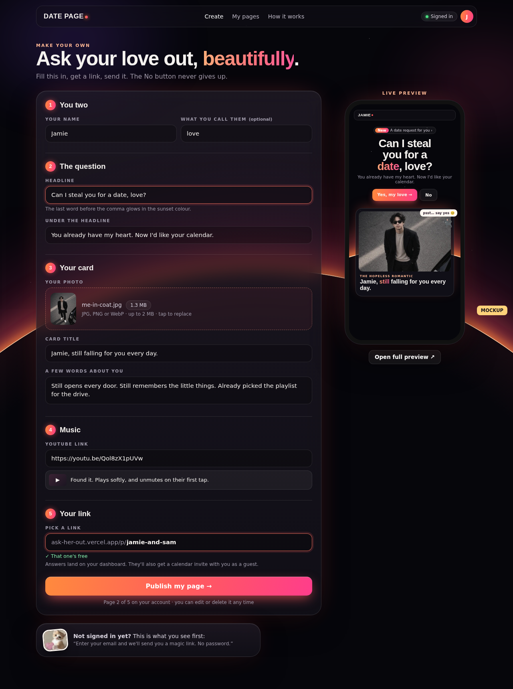 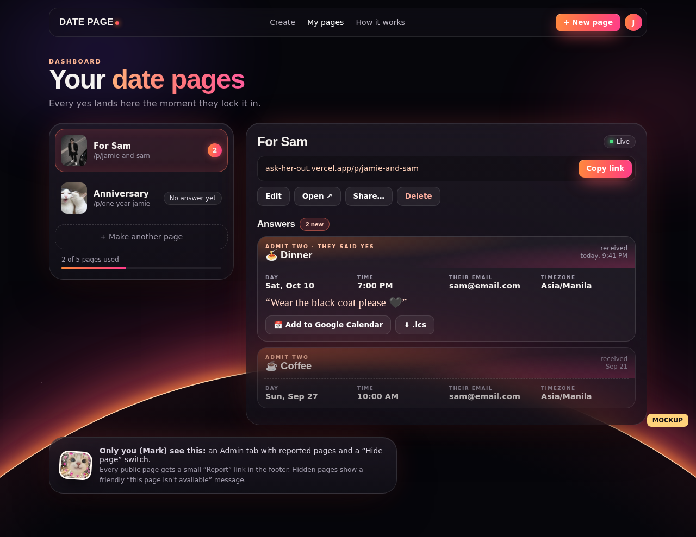

---

## Privacy and safety

- **What's public:** the words, photo and song on your page, and your email if you ticked "Add me as a guest". Who owns a page is not public.
- **What's private:** answers (the day, time, plan, their email and note) are visible only to the page's owner.
- **Photos** are shrunk in your browser before upload, which removes location data. Anyone with a photo's link can view it, the same as the page.
- **Deleting** a page removes its answers and photo.
- **The key in the code** (`sb_publishable_…`) is Supabase's public key and is safe to publish. Row Level Security protects the data. The secret `service_role` key is not in this repo and must never be.
- **See something that shouldn't be there?** Use **Report this page** at the bottom of the page.

---

## FAQ and troubleshooting

**The magic link opened the wrong site, or says "invalid".** Open the newest email only, in the same browser you requested it from. Links expire after about an hour.

**No email arrived.** Check spam and wait a minute. The free email sender only sends a few emails per hour across the whole site, so try again later if it's busy.

**There's no sound.** Browsers block sound until the first tap. Tap anywhere on the page, or the speaker icon in the top bar.

**It says the link is taken.** Someone else has it (or it belongs to a hidden page). Add something, like `jamie-and-sam-2`.

**The calendar time looks off.** The ticket and calendar use the timezone of the person answering. On your dashboard the time is shown in their timezone, labelled next to it.

**Link previews of my page show "MARK".** Known limitation for now: chat apps read the link preview from the page's static tags, which are mine. The page itself shows your words. Per-page previews are the next planned step.

---

## History

The first version was the second thing I ever shipped: a white card, a No button that dodged the mouse, and a lot of `console.log`s. The rebuild kept the idea and fixed what the first one got wrong. The calendar invite used to land at the wrong time (7 PM showed up as 11 AM in the Philippines), the date could show a day early in the Americas, and on phones she could simply tap No. Then came the builder, so anyone can make one. Build notes: [`docs/2026-09-28-rebuild.md`](docs/2026-09-28-rebuild.md) and [`docs/2026-09-28-builder.md`](docs/2026-09-28-builder.md).
